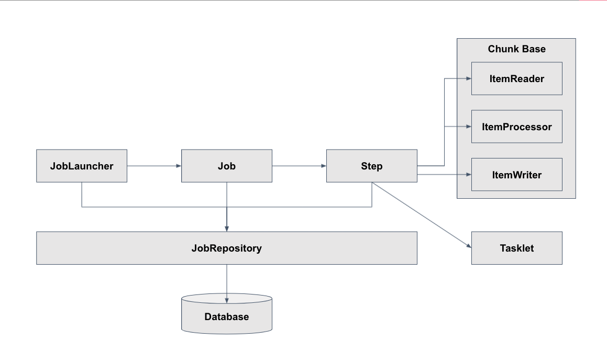
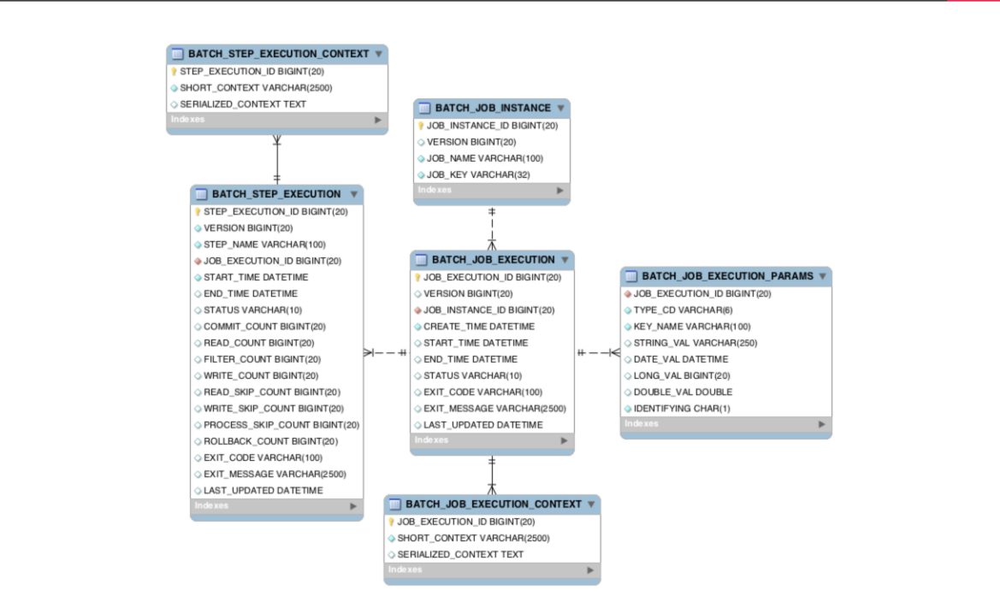
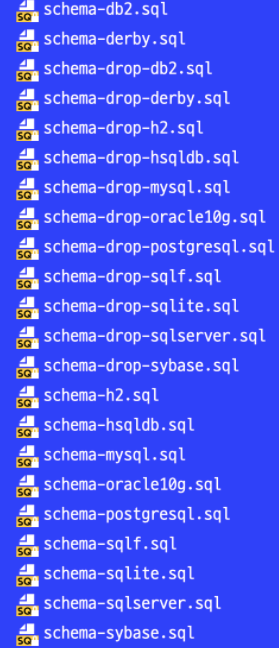
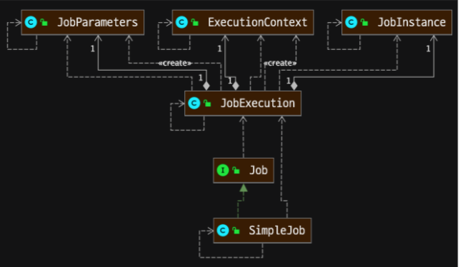
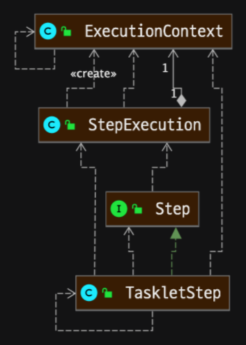

## 스프링 배치 기본 구조

## 스프링 배치 기본 구조 - Job
 - Job은 JobLauncher에 의해 실행
 - Job은 배치의 실행 단위를 의미
 - Job은 N개의 Step을 실행할 수 있으며, 흐름(Flow)을 관리할 수 있다.
    * 예를 들면, A Step 실행 후 조건에 따라 B Step 또는 C Step을 실행 설정
 
## 스프링 배치 기본 구조 - Step
 - Step은 Job의 세부 실행 단위이며, N개가 등록돼 실행된다.
 - Step의 실행 단위는 크게 2가지로 나눌 수 있다.
    1. Chunk 기반 : 하나의 큰 덩어리를 n개씩 나눠서 실행
    2. Task 기반 : 하나의 작업 기반으로 실행
 - Chunk 기반 Step은 ItemReader, ItemProcessor, ItemWriter가 있다.
    * 여기서 Item은 배치 처리 대상 객체를 의미한다.
 - ItemReader는 배치 처리 대상 객체를 읽어 ItemProcessor 또는 ItemWriter에게 전달한다.
    * 예를 들면, 파일 또는 DB에서 데이터를 읽는다.
 - ItemProcessor는 input 객체를 output 객체로 filtering 또는 processing 해 ItemWriter에게 전달한다.
    * 예를 들면, ItemReader에서 읽은 데이터를 수정 또는 ItemWriter 대상인지 filtering 한다.
    * ItemProcessor는 optional 하다.
    * ItemProcessor가 하는 일을 ItemReader 또는 ItemWriter가 대신할 수 있다.
 - ItemWriter는 배치 처리 대상 객체를 처리한다.
    * 예를 들면, DB update를 하거나, 처리 대상 사용자에게 알림을 보낸다.
 
## 스프링 배치 테이블 구조와 이해

- 배치 실행을 위한 메타 데이터가 저장되는 테이블
- BATCH_JOB_INSTANCE
  * Job이 실행되며 생성되는 최상위 계층의 테이블
  * job_name과 job_key를 기준으로 하나의 row가 생성되며, 같은 job_name과 job_key가 저장될 수 없다.
  * job_key는 BATCH_JOB_EXECUTION_PARAMS에 저장되는 Parameter를 나열해 암호화해 저장한다.
- BATCH_JOB_EXECUTION
   * Job이 실행되는 동안 시작/종료 시간, job 상태 등을 관리
- BATCH_JOB_EXECUTION_PARAMS
   * Job을 실행하기 위해 주입된 parameter 정보 저장
- BATCH_JOB_EXECUTION_CONTEXT
   * Job이 실행되며 공유해야할 데이터를  직렬화해 저장
- BATCH_STEP_EXECUTION
   * Step이 실행되는 동안 필요한 데이터 또는 실행된 결과 저장
- BATCH_STEP_EXECUTION_CONTEXT
   * Step이 실행되며 공유해야할 데이터를 직렬화해 저장
- spring-batch-core/org.springframework/batch/core/* 에 위치
- 스프링 배치를 실행하고 관리하기 위한 테이블
- schema.sql 설정
   * schema-**.sql의 실행 구분은
   * DB 종류별로 script가 구분
   * spring.batch.initialize-schema config로 구분한다.
   * ALWAYS, EMBEDDED, NEVER로 구분한다.
      * ALWAYS : 항상 실행
      * EMBEDDED : 내장 DB일 때만 실행
      * NEVER : 항상 실행 안함

## Job, JobInstance, JobExecution, Step, StepExecution 이해
- JobInstance : BATCH_JOB_INSTANCE 테이블과 매핑
- JobExecution : BATCH_JOB_EXECUTION 테이블과 매핑
- JobParameters : BATCH_JOB_EXECUTION_PARAMS 테이블과 매핑
- ExecutionContext : BATCH_JOB_EXECUTION_CONTEXT 테이블과 매핑

- JobInstance의 생성 기준은 JobParamters 중복 여부에 따라 생성된다.
- 다른 parameter로 Job이 실행되면, JobInstance가 생성된다.
- 같은 parameter로 Job이 실행되면, 이미 생성된 JobInstance가 실행된다.
- JobExecution은 항상 새롭게 생성된다.
- 예를 들어
    * 처음 Job 실행 시 date parameter가 1월1일로 실행 됐다면, 1번 JobInstance가 생성된다.
    * 다음 Job 실행 시 date parameter가 1월2일로 실행 됐다면, 2번 JobInstance가 생성된다.
    * 다음 Job 실행 시 date parameter가 1월2일로 실행 됐다면, 2번 JobInstance가 재 실행된다.
        * 이때 Job이 재실행 대상이 아닌 경우 에러가 발생한다.
- Parameter가 없는 Job을 항상 새로운 JobInstance가 실행되도록 RunIdIncrementer가 제공된다.
- StepExecution : BATCH_STEP_EXECUTION 테이블과 매핑
- ExecutionContext : BATCH_STEP_EXECUTION_CONTEXT 테이블과 매핑

## 데이터 공유 ExecutionContext 이해
- Job 내에서 공유할 수 있는 BATCH_JOB_EXECUTION_CONTEXT
- 하나의 Step에서 공유할 수 있는 BATCH_STEP_EXECUTION_CONTEXT

