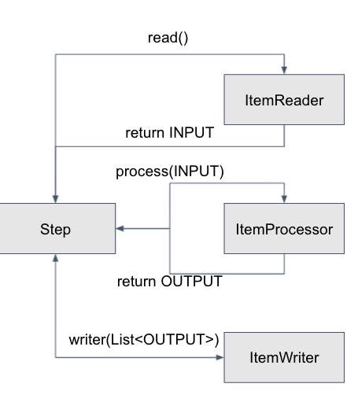
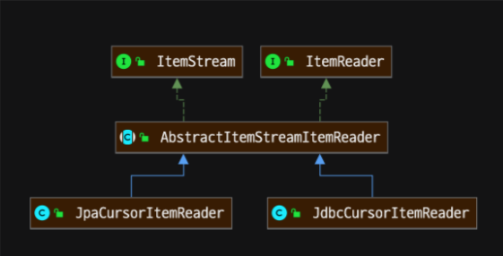
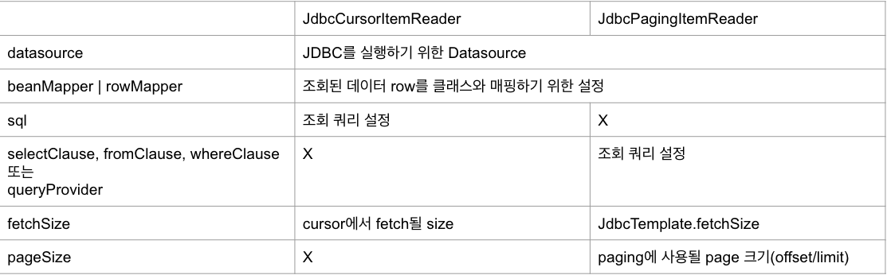

## Task 기반 배치와 Chunk 기반 배치
- 배치를 처리할 수 있는 방법은 크게 2가지
- Tasklet을 사용한 Task 기반 처리
    * 배치 처리 과정이 비교적 쉬운 경우 쉽게 사용
    * 대량 처리를 하는 경우 더 복잡
    * 하나의 큰 덩어리를 여러 덩어리로 나누어 처리하기 부적합
- Chunk를 사용한 chunk(덩어리) 기반 처리
    * ItemReader, ItemProcessor, ItemWriter의 관계 이해 필요
    * 대량 처리를 하는 경우 Tasklet보다 비교적 쉽게 구현
    * 예를 들면 10,000개의 데이터 중 1,000개씩 10개의 덩어리로 수행
        * 이를 Tasklet으로 처리하면 10,000개를 한번에 처리하거나, 수동으로 1,000개씩 분할
- reader에서 null을 return 할 때 까지 Step은 반복
- <INPUT, OUTPUT>chunk(int)
  * reader에서 INPUT 을 return
  * processor에서 INPUT을 받아 processing 후 OUPUT을 return
    * INPUT, OUTPUT은 같은 타입일 수 있음
  * writer에서 List<OUTPUT>을 받아 write
    
    

## JobParameters 이해
- 배치를 실행에 필요한 값을 parameter를 통해 외부에서 주입
- JobParameters는 외부에서 주입된 parameter를 관리하는 객체
- parameter를 JobParameters와 Spring EL(Expression Language)로 접근
  * String parameter = jobParameters.getString(key, defaultValue);
  * @Value(“#{jobParameters[key]}”)

## @JobScope와 @StepScope 이해
- @Scope는 어떤 시점에 bean을 생성/소멸 시킬 지 bean의 lifecycle을 설정
- @JobScope는 job 실행 시점에 생성/소멸
  * Step에 선언
- @StepScope는 step 실행 시점에 생성/소멸
  * Tasklet, Chunk(ItemReader, ItemProcessor, ItemWriter) 에 선언
- Spring의 @Scope과 같은 것
  * @Scope(“job”) == @JobScope
  * @Scope(“step”) == @StepScope
- Job과 Step 라이프사이클에 의해 생성되기 때문에 Thread safe하게 작동
- @Value(“#{jobParameters[key]}”)를 사용하기 위해 @JobScope와 @StepScope는 필수

## ItemReader interface 구조
- 배치 대상 데이터를 읽기 위한 설정
  * 파일, DB, 네트워크, 등에서 읽기 위함.
- Step에 ItemReader는 필수
- 기본 제공되는 ItemReader 구현체
  * file, jdbc, jpa, hibernate, kafka, etc... 
- ItemReader 구현체가 없으면 직접 개발
- ItemStream은 ExecutionContext로 read, write 정보를 저장
  
  

## CSV 파일 데이터 읽기
- FlatFileItemReader 클래스로 파일에 저장된 데이터를 읽어 객체에 매핑

## JDBC 데이터 읽기 - Cursor
- Cursor 기반 조회
  * 배치 처리가 완료될 때 까지 DB Connection이 연결
  * DB Connection 빈도가 낮아 성능이 좋은 반면, 긴 Connection 유지 시간 필요
  * 하나의 Connection에서 처리되기 때문에, Thread Safe 하지 않음
  * 모든 결과를 메모리에 할당하기 때문에, 더 많은 메모리를 사용
- Paging 기반 조회
  * 페이징 단위로 DB Connection을 연결
  * DB Connection 빈도가 높아 비교적 성능이 낮은 반면, 짧은 Connection 유지 시간 필요
  * 매번 Connection을 하기 때문에 Thread Safe
  * 페이징 단위의 결과만 메모리에 할당하기 때문에, 비교적 더 적은 메모리를 사용

