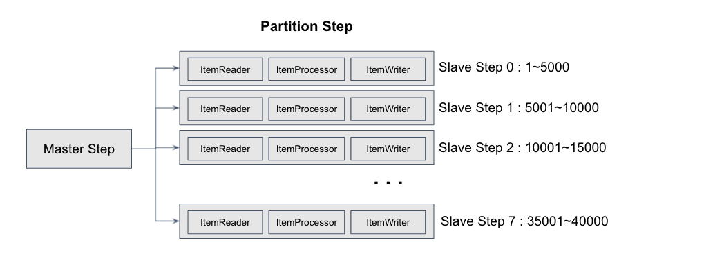
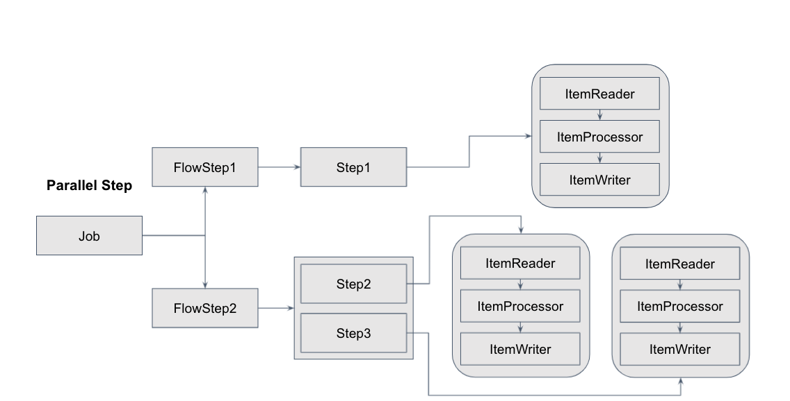

## 성능 개선과 성능 비교
- SaveUserTasklet에서 User 40,000건 저장, Chunk Size는 1,000
- 성능 개선 대상 Step은 userLevelUpStep
- 아래 표 순서대로 실행
    * 예제를 만들고 성능 측정 후 비교
    * 3번 씩 실행
    * 환경에 따라 성능이 다를 수 있음

## Async Step 적용하기
- ItemProcessor와 ItemWriter를 Async로 실행
- java.util.concurrent에서 제공되는 Future 기반 asynchronous
- Async를 사용하기 위해 spring-batch-integration 필요

## Multi-Thread Step 적용하기
- Async Step은 ItemProcessor와 ItemWriter 기준으로 비동기 처리
- Multi-Thread Step은 Chunk 단위로 멀티 스레딩 처리	
- Thread-Safe 한 ItemReader 필수

## Partition Step 적용하기
- 하나의 Master 기준으로 여러 Slave Step을 생성해 Step 기준으로 Multi-Thread 처리
- 예를 들어
  * item이 40,000개, Slave Step이 8개면 
  * 40000 / 8 = 5000 이므로 하나의 Slave Step 당 5,000건 씩 나눠서 처리
- Slave Step은 각각 하나의 Step으로 동작

## Partition Step 적용하기
- n개의 Thead가 Step 단위로 동시 실행
- Multi-Thread Step은 chunk 단위로 동시 실행했다면, Parallel Step은 step 단위로 동시 실행
- 아래 그림을 예로 들면
  * Job은 FlowStep1과 FlowStep2를 순차 실행
  * FlowStep2는 Step2와 Step3을 동시 실행
  * 설정에 따라 FlowStep1과 FlowStep2를 동시 실행도 가능

